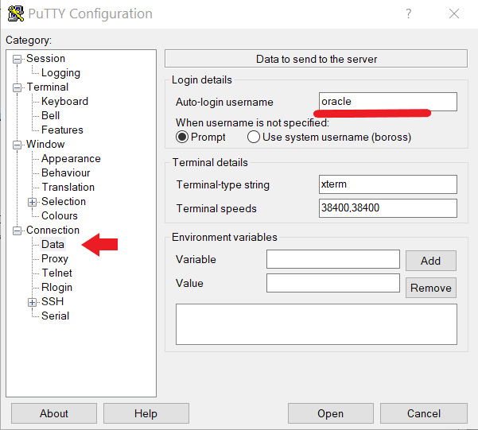

#  Multitenant Workshop setup

## Windows Users can connect to the workshop instance using Putty

1.  Download and **[Install Putty](https://www.putty.org/)** and then open the PuTTY utility from the Windows start menu.   In the dialog box, enter the IP Address of your OCI Compute Instance.  This will be obtained from your instructor.

    

2.  Under **Category** select **Connection** and then choose the **Data** field.  Enter the username username ```oracle```.  

    

3.  Under **Category**, navigate to **Connection** - **SSH** and choose the **Auth** category.   Click on the **Browse** button and locate the ```Private Key file``` you downloaded earlier.   

    

4. Click Session in the left navigation pane.  Enter a new Session Name (like **Oracle MT**) in the Saved Sessions box.  Then click **Save** to save your session details.  You can later **Load** this session if needed.

Now Click the **Open** button to initiate the SSH connection to your cloud instance.  

5.  Click **Yes** to bypass the Security Alert about the uncached key.

    

6.  Connection successful.   You are now securely connected to an OCI Cloud instance.

    

    You are now able to connect securely using the Putty terminal utility.   You can save the connection information for future use and configure PuTTY with your own custom settings.

## Connect from Mac
1. Your instructor provided you an IP address and a secure key (MT-WS-key.ppk).  After downloading the key file, run the following command to change the file permissions to 400 to better secure the key.

````
 chmod 400 MT-WS-key.ppk
 ````
2. Use the key and IP address to log in to the SSH client as shown in the following example.  Remember to use your own IP address.
````
ssh -i MT-WS-key.ppk oracle@192.237.248.66
````
