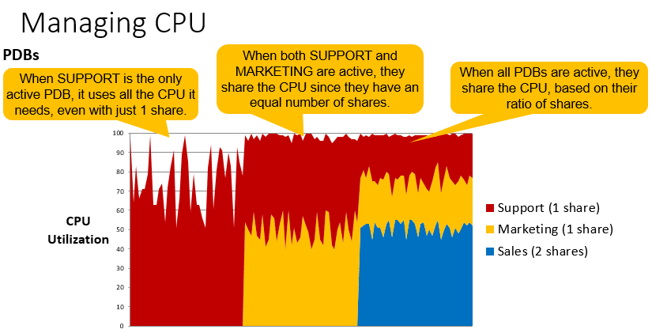

#  Multitenant Tenant Isolation

## Introduction

This is a series of hands-on exercises designed to familiarize you with Oracle Multitenant and the Network isolation feature. In these exercises, you will dive into the concepts of Database Firewalls, Resource management and Lockdown features.

## Step 0: Lab Environment Setup

At this point, it is assumed that you have a Multitenant workshop environment and you have already run the "Multitenant Basics" section.  If you are starting this section before the "Multitenant Basics" section, then run the following setup script.

````
<copy>cd /home/oracle
wget https://objectstorage.us-phoenix-1.oraclecloud.com/n/oraclepartnersas/b/Multitenant/o/labs.zip
chown oracle:oinstall /home/oracle/labs.zip
unzip -o labs.zip
chmod -R +x /home/oracle/labs
/home/oracle/labs/multitenant/resetCDB.sh</copy>
````
If you have not reset after the previous lab, you can run resetCDB.sh to start with a clean environment. If any errors about dropping databases appear they can be ignored.
````
<copy>cd /home/oracle/labs/multitenant
./resetCDB.sh </copy>
````

## Step 1: Service-Level ACLs for TCP Protocol

With the "database service firewall" feature, every database service can have its own access control list (ACL) and the ACL is based on IPs. An access control list in Oracle is a list of access control entries to restrict the hosts that are allowed to connect to the Oracle database.

Because each pluggable database is a different service, this feature enables different pluggable databases to have different ACLs. These ACLs are enforced by the listener. Access to a pluggable database service is enabled only for IPs that are permitted through an ACL.

This functionality is part of Oracle Multitenant since database version 12.2.  


You will be setting up Service-Level ACLs by performing the following steps
   - Install the ACL package
   - Configure the listener
   - Add the IP ADDRESS to the whitelist for each PDB.
   - Verify/test.

1. Install **ACL package**

You need to install a database package called DBMS\_SFW\_ACL\_ADMIN. This is installed by running a script as sysdba. This package is owned by the DBSFWUSER schema.  Here is the [link](https://docs.oracle.com/en/database/oracle/oracle-database/19/arpls/DBMS_SFW_ACL_ADMIN.html) to Oracle 19C documentation.
````
<copy>sqlplus sys/oracle@//localhost:1523/cdb1 as sysdba @$ORACLE_HOME/rdbms/admin/dbmsaclsrv.sql 
exit;</copy>
````
````
[oracle@mtv30 ~]$ sqlplus sys/oracle@//localhost:1523/cdb1 as sysdba 

SQL*Plus: Release 19.0.0.0.0 - Production on Fri Jul 17 16:14:01 2020
Version 19.5.0.0.0

Copyright (c) 1982, 2019, Oracle.  All rights reserved.

Connected.
SQL> @$ORACLE_HOME/rdbms/admin/dbmsaclsrv.sql

Session altered.

Grant succeeded.

Grant succeeded.

Grant succeeded.

Grant succeeded.

Grant succeeded.

Grant succeeded.

Grant succeeded.

Grant succeeded.

Package created.

Session altered.

SQL> exit;
````
2.  Configure the **listener** by editing **listener.ora**

**First, make a backup copy of the current listener configuration file.**

````
<copy>cp $ORACLE_HOME/network/admin/listener.ora $ORACLE_HOME/network/admin/listener.backup 
````

The LOCAL\_REGISTRATION\_ADDRESS\_lsnr\_alias and FIREWALL setting must be added to the "listener.ora" file.  In our example the CDB1 container DB is listening on listener **LISTCDB1**.  

The `FIREWALL` attribute must be added to the listener endpoint to control the action of the database firewall.  There are two settings for FIREWALL.

   - `FIREWALL=ON` : Only connections matching an ACL are considered valid. All other connections are rejected.
   - `FIREWALL=OFF` : The firewall functionality is disabled, so all connections are considered valid.

Use your favorite editor (like "vi") to edit listener.ora to make the edits in red shown below.<b> Just add the text in red, your VM has a different hostname so do not copy the entire box below.</b>

````
$ <copy>vi $ORACLE_HOME/network/admin/listener.ora </copy>
````
You will need to add the following line to the end of the "listener.ora" file.
````
<copy>LOCAL_REGISTRATION_ADDRESS_LISTCDB1 = ON</copy>
````

  <pre>
LISTCDB1 =
  (DESCRIPTION_LIST =
    (DESCRIPTION =
      (ADDRESS =
         (PROTOCOL = TCP)
         (HOST = adb548-oracle-jul16-09 )
         (PORT = 1523 )
         <b><font color="red">(FIREWALL = ON)</font></b>
      )
    )
  )

LISTCDB2 =
  (DESCRIPTION_LIST =
    (DESCRIPTION =
      (ADDRESS =
         (PROTOCOL = TCP)
         (HOST = adb548-oracle-jul16-09 )
         (PORT = 1524 )
      )
    )
  )

<b><font color="red">LOCAL_REGISTRATION_ADDRESS_LISTCDB1 = ON</font></b>

</pre>

3. **Restart listener and verify FIREWALL=ON.**

````
<copy>lsnrctl stop listcdb1
lsnrctl start listcdb1
lsnrctl status listcdb1 </copy>
````
````
[oracle@adb548-oracle-jul16-09 ~]$ lsnrctl stop listcdb1

LSNRCTL for Linux: Version 19.0.0.0.0 - Production on 17-JUL-2020 17:17:30

Copyright (c) 1991, 2019, Oracle.  All rights reserved.

Connecting to (DESCRIPTION=(ADDRESS=(PROTOCOL=TCP)(HOST=adb548-oracle-jul16-09)(PORT=1523)(FIREWALL=ON)))
The command completed successfully
````
````
[oracle@adb548-oracle-jul16-09 ~]$ lsnrctl start listcdb1

LSNRCTL for Linux: Version 19.0.0.0.0 - Production on 17-JUL-2020 17:19:24

Copyright (c) 1991, 2019, Oracle.  All rights reserved.

Starting /u01/app/oracle/product/19c/dbhome_1/bin/tnslsnr: please wait...

TNSLSNR for Linux: Version 19.0.0.0.0 - Production
System parameter file is /u01/app/oracle/product/19c/dbhome_1/network/admin/listener.ora
Log messages written to /u01/app/oracle/diag/tnslsnr/adb548-oracle-jul16-09/listcdb1/alert/log.xml
Listening on: (DESCRIPTION=(ADDRESS=(PROTOCOL=tcp)(HOST=adb548-oracle-jul16-09)(PORT=1523)(FIREWALL=ON)))

Connecting to (DESCRIPTION=(ADDRESS=(PROTOCOL=TCP)(HOST=adb548-oracle-jul16-09)(PORT=1523)(FIREWALL=ON)))
STATUS of the LISTENER
------------------------
Alias                     listcdb1
Version                   TNSLSNR for Linux: Version 19.0.0.0.0 - Production
Start Date                17-JUL-2020 17:19:24
Uptime                    0 days 0 hr. 0 min. 0 sec
Trace Level               off
Security                  ON: Local OS Authentication
SNMP                      OFF
Listener Parameter File   /u01/app/oracle/product/19c/dbhome_1/network/admin/listener.ora
Listener Log File         /u01/app/oracle/diag/tnslsnr/adb548-oracle-jul16-09/listcdb1/alert/log.xml
Listening Endpoints Summary...
  (DESCRIPTION=(ADDRESS=(PROTOCOL=tcp)(HOST=adb548-oracle-jul16-09)(PORT=1523)(FIREWALL=ON)))
The listener supports no services
The command completed successfully
````
````
[oracle@adb511-virtual-jul23-01 multitenant]$ lsnrctl status listcdb1

LSNRCTL for Linux: Version 19.0.0.0.0 - Production on 24-JUL-2020 13:29:30

Copyright (c) 1991, 2019, Oracle.  All rights reserved.

Connecting to (DESCRIPTION=(ADDRESS=(PROTOCOL=TCP)(HOST=adb511-virtual-jul23-01)(PORT=1523)(FIREWALL=ON)))
STATUS of the LISTENER
------------------------
Alias                     listcdb1
Version                   TNSLSNR for Linux: Version 19.0.0.0.0 - Production
Start Date                24-JUL-2020 13:29:28
Uptime                    0 days 0 hr. 0 min. 1 sec
Trace Level               off
Security                  ON: Local OS Authentication
SNMP                      OFF
Listener Parameter File   /u01/app/oracle/product/19c/dbhome_1/network/admin/listener.ora
Listener Log File         /u01/app/oracle/diag/tnslsnr/adb511-virtual-jul23-01/listcdb1/alert/log.xml
Listening Endpoints Summary...
  (DESCRIPTION=(ADDRESS=(PROTOCOL=tcp)(HOST=adb511-virtual-jul23-01)(PORT=1523)(FIREWALL=ON)))
The listener supports no services
The command completed successfully
````
Check to see if your services were restarted.  It can take up to 5 minutes before all services have been registered again. If you want to speed this up, login to the CDB1 using SQL*Plus and execute the command 'alter system register;'.

Once all the listener services are available, specifically the 'pdb1' service, you can continue with the exercise.

4. Connect to **CDB1**  

````
<copy>sqlplus / as sysdba</copy>
````

5. Register the Services

````
<copy>alter system register; 
exit;</copy>
````

6. Check that the Services are started

````
$ <copy>lsnrctl status listcdb1</copy>
````
````
SQL> alter system register;
System altered.

SQL> exit;
Disconnected from Oracle Database 19c Enterprise Edition Release 19.0.0.0.0 - Production
Version 19.5.0.0.0

[oracle@adb513-virtual-jul21-20 ~]$ lsnrctl status listcdb1

LSNRCTL for Linux: Version 19.0.0.0.0 - Production on 22-JUL-2020 23:42:23

Copyright (c) 1991, 2019, Oracle.  All rights reserved.

Connecting to (DESCRIPTION=(ADDRESS=(PROTOCOL=TCP)(HOST=adb513-virtual-jul21-20)(PORT=1523)(FIREWALL=ON)))
STATUS of the LISTENER
------------------------
Alias                     listcdb1
Version                   TNSLSNR for Linux: Version 19.0.0.0.0 - Production
Start Date                22-JUL-2020 23:37:56
Uptime                    0 days 0 hr. 4 min. 26 sec
Trace Level               off
Security                  ON: Local OS Authentication
SNMP                      OFF
Listener Parameter File   /u01/app/oracle/product/19c/dbhome_1/network/admin/listener.ora
Listener Log File         /u01/app/oracle/diag/tnslsnr/adb513-virtual-jul21-20/listcdb1/alert/log.xml
Listening Endpoints Summary...
  (DESCRIPTION=(ADDRESS=(PROTOCOL=tcp)(HOST=adb513-virtual-jul21-20)(PORT=1523)(FIREWALL=ON)))
Services Summary...
Service "CDB1" has 1 instance(s).
  Instance "CDB1", status READY, has 1 handler(s) for this service...
Service "CDB1XDB" has 1 instance(s).
  Instance "CDB1", status READY, has 1 handler(s) for this service...
Service "a206980f93d62602e0530200000ab752" has 1 instance(s).
  Instance "CDB1", status READY, has 1 handler(s) for this service...
Service "ab1048c516387598e053e801000a09dc" has 1 instance(s).
  Instance "CDB1", status READY, has 1 handler(s) for this service...
Service "pdb1" has 1 instance(s).
  Instance "CDB1", status READY, has 1 handler(s) for this service...
Service "pdb2" has 1 instance(s).
  Instance "CDB1", status READY, has 1 handler(s) for this service...
The command completed successfully
````
7. Test connection to the PDB1 pluggable database

Create a policy whitelist in access control list (ACL) that contains a list of hosts that are allowed access to a specific database service. Local listeners and server processes validate all inbound client connections against the ACL.

Once the firewall is set and the listener is restarted, you will need to add the IP address of every server connection that can be accepted per PDB. We are creating a whitelist of all IP addresses that can connect to a service. In our multitenant environment, CDB1 and PDB1 are both services. We can add additional user defined services and add whitelist to them as well.

Try to login to **PDB1** in your localhost before putting an IP address in the whitelist.
````
<copy>sqlplus sys/oracle@//localhost:1523/pdb1 as sysdba</copy>
````

````
$ sqlplus sys/oracle@//localhost:1523/pdb1 as sysdba

SQL*Plus: Release 19.0.0.0.0 - Production on Fri Jul 17 19:19:00 2020
Version 19.5.0.0.0

Copyright (c) 1982, 2019, Oracle.  All rights reserved.

<b>ERROR:
ORA-12506: TNS:listener rejected connection based on service ACL filtering</b>
````

You will see that the connection fails with error ORA-12506 since the local host IP address is not yet included in the listener whitelist.  

8. Add IP address to PDB whitelist.**

So now we are going to add our IP address or hostname to the whitelist for the (default) service PDB1.  

Connect to PDB1 locally using OS authentication.  **You should notice that you can connect locally using OS authentication.**
````
<copy>sqlplus / as sysdba</copy>
````
````
<copy>show pdbs
exec  dbsfwuser.DBMS_SFW_ACL_ADMIN.ip_add_ace('pdb1','localhost');
exec  dbsfwuser.DBMS_SFW_ACL_ADMIN.commit_acl; </copy>
````
````
SQL>  exec dbsfwuser.DBMS_SFW_ACL_ADMIN.ip_add_ace('pdb1','localhost');
PL/SQL procedure successfully completed.

SQL> exec  dbsfwuser.DBMS_SFW_ACL_ADMIN.commit_acl;

PL/SQL procedure successfully completed.
````
8. Again Test connection to the PDB1 pluggable database after adding localhost to the whitelist ACL list.
````
<copy>connect sys/oracle@//localhost:1523/pdb1 as sysdba </copy>

SQL> connect sys/oracle@//localhost:1523/pdb1 as sysdba
Connected.
````
You can now connect to PDB1 successfully from localhost since we added localhost to the whitelist. If you wanted to test with an IP address or external host in this environment, we would first have to open port 1523 in Oracle Cloud's Virtual Cloud Network (VCN) and add port 1523 in the linux firewall.  

9. Look at the view V$IP_ACL to see the active ACLs.

````
- Display the saved ACLs.
<copy>
COLUMN service_name FORMAT A30
COLUMN host FORMAT A30

-- Display the active ACLs.
SELECT service_name,
       host,
       con_id
FROM   v$ip_acl
ORDER BY 1, 2;
exit; </copy>

SERVICE_NAME                   HOST                               CON_ID
------------------------------ ------------------------------ ----------
PDB1                           LOCALHOST                               3
````
10. Reset the Listener.ora

This is the end of the exercise. Reset your environment so that it is ready for the next exercise by restoring and restarting the original listener. 
````
$ <copy>cp $ORACLE_HOME/network/admin/listener.backup $ORACLE_HOME/network/admin/listener.ora
lsnrctl stop LISTCDB1
lsnrctl start LISTCDB1</copy>
````

## Step 2: Multitenant PDB Lockdown Profile

Tenant isolation is a key requirement for security in a multitenant environment. A PDB Lockdown Profile allows you to restrict the operations and functionality available from within a PDB. This can be very useful from a security perspective, giving the PDBs a greater degree of separation and allowing different people to manage each PDB, without compromising the security of other PDBs within the same container database.

The following video is from Oracle Product Manager Patrick Wheeler. He gives a short explanation of PDB Lockdown Profiles.
[](youtube:kop6fruRC-I)

A Lockdown Profile can prevent PDB users from:

1. Executing certain SQL statements, such as ALTER SYSTEM and ALTER SESSION
2. Running procedures that access the network (e.g. UTL\_SMTP, UTL\_HTTP)
3. Accessing a common user's objects
4. Interacting with the OS (In addition to the capabilities covered by PDB\_OS\_CREDENTIAL)
5. Making unrestricted cross-PDB connections in a CDB
6. Taking AWR snapshots
7. Using JAVA partially or as a whole
8. Using certain database options such as Advanced Queueing and Partitioning

See the [Oracle Database Security Guide](https://docs.oracle.com/en/database/oracle/oracle-database/19/dbseg/configuring-privilege-and-role-authorization.html) for more information on PDB Lockdown Profiles.

- A single Lockdown Profile can have several rules defined in it. In other words, you don't have to create a Lockdown Profile for every restriction you want to implement.

- A PDB can have only one Lockdown Profile active at a time.

- The restrictions enforced by a Lockdown Profile are PDB-wide, they affect every single user including SYS and SYSTEM.

- If you enable a Lockdown Profile in CDB Root, it affects all PDBs in the CDB. If you enable it in an Application Root (App Root), it affects all Application PDBs (App PDBs) under that App Root. If you enable it within a PDB, it only affects that PDB.

The steps are
- Create Lockdown Profile
- Add statements to the Lockdown Profile 
- Set PDB_LOCKDOWN parameter

1. Connect to **CDB1**  
````
<copy>sqlplus sys/oracle@localhost:1523/cdb1 as sysdba</copy>
````

2. Create a Lockdown Profile.
````
<copy>show con_name
show pdbs

create lockdown profile TENANT_LOCK; </copy>
````

3. Add restrictions to the Lockdown Profile

In our test, you will lockdown the Oracle partitioning option and the indivicual SQL statement **alter system**.
````
<copy>alter lockdown profile sec_profile disable option=('Partitioning');
alter lockdown profile sec_profile disable statement=('alter system') clause=('set') option all;</copy>
````

The scope of the restriction can be reduced using the CLAUSE, OPTION, MINVALUE, MAXVALUE options and values.
 <pre>
 eg. ALTER LOCKDOWN PROFILE hr_prof
     DISABLE STATEMENT = ('ALTER SYSTEM')
          CLAUSE = ('SET')
          OPTION = ('CPU_COUNT')
          MINVALUE = '2'
          MAXVALUE = '6';
</pre>

In the following example, you will prohibit the ability to change the parameter CURSOR_SHARING in a PDB. Changing this parameter could cause changes in performance and behavior and affect other tenants in the CDB. Adding a rule to the newly created TENANT\_LOCK Lockdown Profile is done with an ALTER LOCKDOWN PROFILE command. We will also lockdown the use of the partitioning option in the Lockdown Profile.

````
<copy>ALTER LOCKDOWN PROFILE TENANT_LOCK DISABLE STATEMENT=('alter system') CLAUSE=('set') OPTION=('cursor_sharing');
ALTER LOCKDOWN PROFILE TENANT_LOCK DISABLE OPTION=('Partitioning'); </copy>
````
````
SQL> ALTER LOCKDOWN PROFILE TENANT_LOCK DISABLE STATEMENT=('alter system') CLAUSE=('set') OPTION=('cursor_sharing');
Lockdown Profile altered.

SQL> ALTER LOCKDOWN PROFILE TENANT_LOCK DISABLE OPTION=('Partitioning');
Lockdown Profile altered.

4. View the Lockdown Profile restrictions
````
Information about PDB Lockdown Profiles can be displayed using the DBA\_LOCKDOWN\_PROFILES view.
````
<copy>SET LINESIZE 200
COLUMN profile_name format a20
COLUMN rule_type FORMAT A20
COLUMN rule_type FORMAT A10
COLUMN rule format a13
COLUMN clause FORMAT A5
COLUMN clause_option FORMAT A15

select profile_name, rule_type, rule, clause, clause_option, status, users from DBA_LOCKDOWN_PROFILES; </copy>
````
````
SQL> select profile_name, rule_type, rule, clause, clause_option, status, users from DBA_LOCKDOWN_PROFILES;

PROFILE_NAME         RULE_TYPE  RULE          CLAUS CLAUSE_OPTION   STATUS  USERS
-------------------- ---------- ------------- ----- --------------- ------- ------
PRIVATE_DBAAS                                                       EMPTY
PUBLIC_DBAAS                                                        EMPTY
SAAS                                                                EMPTY
TENANT_LOCK          OPTION     PARTITIONING                        DISABLE ALL
TENANT_LOCK          STATEMENT  ALTER SYSTEM  SET   CURSOR_SHARING  DISABLE ALL
````
5. Test permissions before assigning a Lockdown Profile 
Verify you can change the CURSOR\_SHARING parameter.

Connect to container PDB1 and display the value of CURSOR_SHARING
````
<copy>alter session set container=PDB1;
show parameter cursor_sharing</copy>
````
````
SQL>  alter session set container=PDB1;
Session altered.

SQL> show parameter cursor_sharing
NAME                                 TYPE        VALUE
------------------------------------ ----------- ------------------------------
cursor_sharing                       string      EXACT
````
Change the value oF CURSOR_SHARING to FORCE
````
SQL> <copy>alter system set cursor_sharing = FORCE; </copy>

System altered.
````
Verify you can create a partitioned table.
````
SQL><copy> create table MyPartitionedTable1 (id number) partition by hash (id) partitions 2;</copy>

Table created.
````

6. Set the Lockdown Profile to TENANT\_LOCK
We saw that the DBA could create partitioned tables and alter initialization parameters. Now lets assign the Lockdown Profile TENANT\_LOCK to this PDB.  
````
<copy>show parameter pdb_lockdown
alter system set PDB_LOCKDOWN=TENANT_LOCK;
show parameter pdb_lockdown</copy>
````
````
System altered.
SQL> show parameter pdb_lockdown

NAME                                 TYPE        VALUE
------------------------------------ ----------- ------------------------------
pdb_lockdown                         string      TENANT_LOCK
````
7. Test permissions after assigning a Lockdown Profile 
````
SQL> <copy>alter system set cursor_sharing=EXACT;</copy>
alter system set cursor_sharing=EXACT
*
ERROR at line 1:
ORA-01031: insufficient privileges
````
Test to see if you can create a partitioned table when the profile is enabled.
````
SQL> <copy>create table MyPartitionedTable2 (id number) partition by hash (id) partitions 2;</copy>
create table MyPartitionedTable2(id number) partition by hash (id) partitions 2
*
ERROR at line 1:
ORA-00439: feature not enabled: Partitioning
````
As you can see, you are not able to create a partitioned table or alter initialization parameters from PDB1 even with SYS privileges.  

8. Drop the Lockdown Profile and unset the parameter.

````
<copy>show parameter pdb_lockdown
alter system set pdb_lockdown='';
drop lockdown profile TENANT_LOCK; 
show parameter pdb_lockdown </copy>
````
This is the end of the Multitenant Lockdown exercise.

## Step 3: Resource Management
In a CDB, workloads within multiple PDBs can compete for system and CDB resources. Resource plans solve this problem.

In a multitenant environment, Resource Manager operates on two levels:
- CDB level :
Resource Manager can manage the workloads for multiple PDBs that are contending for system and CDB resources. You can specify how resources are allocated to PDBs, and you can limit the resource utilization of specific PDBs. The principal tool is a CDB resource plan. For Tenant isolation we need to implement at CDB level.

- PDB level :
Resource Manager can manage the workloads within each PDB. The principal tool is a PDB resource plan.

In a CDB with multiple PDBs, The Resource Manager enables you to prioritize and limit the resource usage of specific PDBs. With the Resource Manager, you can:

- Limit the CPU usage of a particular PDB

- Limit the number of parallel execution servers that a particular PDB can use

- Limit the memory usage of a particular PDB

- Specify the amount of memory guaranteed for a particular PDB

- Specify the maximum amount of memory a particular PDB can use

- Limit the I/O generated by specific PDBs

### Memory Resource Management

The advantage of having multitenant is that all the memory in a server can be provided to a single CDB and memory can be optimally utilized. However, the following parameters can be set at the PDB level to better manager resources and ensure that the CDB and the other PDBs have sufficient memory for their operations. 

#### PDB Memory Parameters
The following parameters can be set at the PDB level.

- DB\_CACHE\_SIZE : The minimum buffer cache size for the PDB.
- SHARED\_POOL\_SIZE : The minimum shared pool size for the PDB.
- PGA\_AGGREGATE\_LIMIT : The maximum PGA size for the PDB.
- PGA\_AGGREGATE\_TARGET : The target PGA size for the PDB.
- SGA\_MIN\_SIZE : The minimum SGA size for the PDB.
- SGA\_TARGET : The maximum SGA size for the PDB.

The initialization parameters control the memory usage of PDBs only if the following conditions are met:

The NONCDB_COMPATIBLE initialization parameter is set to false in the CDB root.

The MEMORY_TARGET initialization parameter is not set or is set to 0 (zero) in the CDB root.

Let us set SGA_TARGET for PDB1 to 1G. First verify the default settings to enable Memory management.
````
<copy>conn / as SYSDBA
show parameter  NONCDB_COMPATIBLE
show parameter MEMORY_TARGET </copy>
````

````
SQL> show parameter NONCDB_COMPATIBLE
NAME                                 TYPE        VALUE
------------------------------------ ----------- ------------------------------
noncdb_compatible                    boolean     FALSE

SQL> show parameter MEMORY_TARGET
NAME                                 TYPE        VALUE
------------------------------------ ----------- ------------------------------
memory_target                        big integer 0
````
Next check the value of SGA_TARGET in CDB1 and PDB1.

````
<copy>show parameter sga_target
ALTER SESSION SET CONTAINER=pdb1;
show parameter SGA_TARGET</copy>
````
````
SQL> show parameter sga_target
NAME                                 TYPE        VALUE
------------------------------------ ----------- ------------------------------
sga_target                           big integer 4432M

SQL> ALTER SESSION SET CONTAINER=pdb1;
Session altered.

SQL> SHOW PARAMETER sga_target;
NAME                                 TYPE        VALUE
------------------------------------ ----------- ------------------------------
sga_target                           big integer 0
````

Set SGA_TARGET for pdb1
````
<copy>ALTER SYSTEM SET sga_target=1G SCOPE=BOTH;
SHOW PARAMETER sga_target;</copy>
````
````
SQL> ALTER SYSTEM SET sga_target=1G SCOPE=BOTH;
System altered.
SQL> SHOW PARAMETER sga_target;
NAME                                 TYPE        VALUE
------------------------------------ ----------- ------------------------------
sga_target                           big integer 1G
````
You have successfully set a limit of memory PDB1 can use.

#### Monitoring Memory Usage for PDBs
Oracle now provides views to monitor the resource (CPU, I/O, parallel execution, memory) usage of PDBs. Each view contains similar information, but for different retention periods.

- V$RSRCPDBMETRIC : A single row per PDB, holding the last of the 1 minute samples.
- V$RSRCPDBMETRIC_HISTORY : 61 rows per PDB, holding the last 60 minutes worth of samples from the V$RSRCPDBMETRIC view.
- V$RSRC_PDB : Cumulative statistics since the CDB resource plan ws set.
- DBA\_HIST\_RSRC\_PDB\_METRIC : AWR snaphots, retained based on the AWR retention period.

### CPU Resources Management

Two ways to limit CPU resources
- Instance Caging with CPU\_COUNT
- Resource Manager with CPU\_MIN\_COUNT ( new in 19c)

Instance caging is a technique that uses an initialization parameter to limit the number of CPUs that an instance can use simultaneously. You can set CPU\_COUNT at the PDB level. If Resource Manager is enabled, then the PDB is **caged** (restricted) to the number of CPUs specified by CPU\_COUNT. This count can be dynamically altered. In an Oracle database hosting environment, the ability to alter CPU\_COUNT is useful to scale cpus up and down in PDBs.  Another advantage is oracle can monitor resource usage. The resource limits can dynamically trigger a change of the CPU\_COUNT. The CPUs will be available in all the sessions in the PDB immediately. This way, we can dynamically scale the CPUs for PDB tenants.

Resource Manager allows one Oracle process per CPU to run at a given time. All other processes wait on an internal Resource Manager run queue, under the wait event "resmgr:cpu quantum". Resource Manager allows an Oracle process to run for a small quantum of time (100 milliseconds). At the end of this quantum or when the Oracle process starts a wait (e.g. for a lock or I/O), Resource Manager selects a new Oracle process to run. Resource Manager uses a round-robin algorithm , and has priority Queues to choose between all runnable processes.

As mentioned above, to setup Instance Caging, we need to enable Resource Manager and set CPU\_COUNT at the PDB level.
````
<copy>conn / as SYSDBA
show parameter CPU_COUNT
show parameter resource_</copy>
````
set default resource manager plan
````
SQL> <copy> alter system set resource_manager_plan='DEFAULT_CDB_PLAN' ; </copy>

System altered.

````
set CPU count in pdb1
````
<copy>alter session set container=pdb1;
alter system set cpu_count=1;
show parameter CPU_COUNT</copy>
````
````
SQL> alter session set container=pdb1;
Session altered.

SQL> alter system set cpu_count=1;
System altered.

SQL> show parameter cpu_count
NAME                                 TYPE        VALUE
------------------------------------ ----------- ------------------------------
cpu_count                            integer     1
````
That is it. By setting the parameter resource\_manager\_plan in the CDB and setting the CPU\_COUNT parameter in the PDB, you have setup instance caging.  To test this, you can run the sample workload.

````
 SQL> <copy> @/home/oracle/labs/multitenant/cpu_test.sql</copy>
````
You can open a separate terminal and run "top -c " and look at "%Cpu(s):" in your environment.
It will be limited to the percentage equal to one cpu. In our case, Total cpus were 2, so 1 cpu would be 50% cpu utilization.

In a production system with many CPUs and PDB consolidation, it is possible to over provision. i.e. The total of CPU\_COUNT at PDB level is more than allocated at CDB level. This is a recommended configuration if we want better CPU utilization of the system.

Now unset the CPU caging and rerun the workload. In our test, the cpu utilization peaks to 100% consuming the 2 CPUs available.

````
 <copy>conn / as SYSDBA
 alter system set resource_manager_plan='';
 alter session set container=PDB1;
 alter system set cpu_count=0;
 @/home/oracle/labs/multitenant/cpu_test.sql</copy>
 ````
The workload without resource management runs faster as it makes use of all the CPUs.

Resource Manager CPU.

Another way of managing CPU resources is through Resource Manager. We allocate a certain number of shares to each PDB. The amount of CPUs allocated to the PDB is equal to the percentage of shares of that PDB compared to the total number of shares across all the PDBS.

To allocate resources among PDBs, assign a share value to each PDB. Until 19c database, the shares were allocated to each pdb through dbms\_resource\_manager PL/SQL package. Since 19c, a new parameter has been introduced called CPU\_MIN\_COUNT. This allows us to set the minimum CPUs available per PDB.

CPU\_MIN\_COUNT is the minimum number of CPUs the Pluggable Database Instance will receive.  The total of CPU\_MIN\_COUNT for all Pluggable Database instances should not exceed the CPU\_COUNT of the Container Database instance. When Database Resource Manager (DBRM) is enabled, and when CPU\_MIN\_COUNT has been set, the CPU\_COUNT parameter defines the maximum number of CPUs that can be used by a Pluggable Database Instance.

CPU\_MIN\_COUNT allows the PDB tenant to utilize 100% of the CPUs allocated to the CDB if there is no load on the system. Only when the workload on the system is more than 100% of the CPUs allocated to the CDB and workload is from more than one PDB, will the resource manager kick in and prioritize CPU resource based on the percentage of shares or CPU\_MIN\_COUNT.

The steps to set this is
- At the CDB level
    -- Set resource\_manager\_plan = default\_cdb\_plan
- For each PDB
    -- Set cpu\_min\_count to specify its shares
    -- Set cpu_count to specify its limit


 


 Connect to CDB1 and set the resource plan.
````
 <copy>
 connect / as SYSDBA
 show parameter cpu_
 show parameter resource_manager_plan
 alter system set resource_manager_plan='DEFAULT_CDB_PLAN';
 show parameter resource_manager_plan </copy>
````

````
SQL>
NAME                                 TYPE        VALUE
------------------------------------ ----------- ------------------------------
cpu_count                            integer     4
cpu_min_count                        string      4
resource_manager_cpu_allocation      integer     4
SQL>
NAME                                 TYPE        VALUE
------------------------------------ ----------- ------------------------------
resource_manager_plan                string
SQL>
System altered.

NAME                                 TYPE        VALUE
------------------------------------ ----------- ------------------------------
resource_manager_plan                string      DEFAULT_CDB_PLAN

````

Create PDB and set the CPU\_MIN\_COUNT.
````
<copy>create pluggable database pdb_2 admin user admin identified by oracle ;
alter pluggable database pdb_2 open;
alter session set container=pdb_2;
show parameter cpu_
alter system set cpu_min_count=1;
</copy>
````
````
SQL> create pluggable database pdb_2 admin user admin identified by oracle ;

Pluggable database created.

SQL> alter pluggable database pdb_2 open;

Pluggable database altered.

SQL> alter session set container=pdb_2;

Session altered.

SQL> show parameter cpu_

NAME                                 TYPE        VALUE
------------------------------------ ----------- ------------------------------
cpu_count                            integer     4
cpu_min_count                        string      4
resource_manager_cpu_allocation      integer     4
SQL> alter system set cpu_min_count=1;

System altered.

SQL> show parameter cpu_

NAME                                 TYPE        VALUE
------------------------------------ ----------- ------------------------------
cpu_count                            integer     4
cpu_min_count                        string      1
resource_manager_cpu_allocation      integer     4
````

That's it. With 2 simple steps, the minimum resource is set. If you need to set instance Caging, you can set CPU\_COUNT in PDB level as well.

By default, CPU\_MIN\_COUNT = CPU\_COUNT, If sum(CPU\_MIN\_COUNT) <= CDB’s CPU\_COUNT , then each PDB is guaranteed CPU\_MIN\_COUNT CPUs

To test this let us run some high CPU workload in PDB\_2. You will observer that the CPU utilization on the system will be 100%. Next when we put the same workload into PDB1 , where CPU\_MIN\_COUNT=CPU\_COUNT=4, we will observe that while the PDB1 will capture a greater percent of CPU.

Note that the workload script is single threaded and has a default of 4 threads. If you are testing this on servers with more cpus, you can increase the thread_count.

````
<copy>
alter session set container=pdb_2;
@/home/oracle/labs/multitenant/cpu_test.sql </copy>
````
````
SQL> alter session set container=pdb_2;
@/home/oracle/labs/multitenant/cpu_test.sql
Session altered.
SQL>
PL/SQL procedure successfully completed.
````
If you open another session and monitor CPU utilization , it should be 100%. However, to find out which PDB is consuming CPUs, we need to look at  V$RSRCPDBMETRIC.
In a new session , run the following script to see the CPU utilization per PDB.

````
<copy>sqlplus / as SYSDBA
COLUMN PDB_NAME FORMAT A10
COLUMN CPU_UTILIZATION_LIMIT 9999
SELECT r.CON_ID,
       p.PDB_NAME,
       r.CPU_UTILIZATION_LIMIT,
       round(r.AVG_CPU_UTILIZATION) AVG_CPU_UTILIZATION,
       count(job) JOB_sess
FROM   V$RSRCPDBMETRIC r,
       CDB_PDBS p,
       cdb_jobs j
WHERE r.CON_ID = p.CON_ID
AND j.CON_ID(+)=r.CON_id
group by
r.CON_ID,
p.PDB_NAME,
r.CPU_UTILIZATION_LIMIT,
r.AVG_CPU_UTILIZATION
order by r.con_id asc; </copy>
````
````
SQL>
SQL> /

    CON_ID PDB_NAME   CPU_UTILIZATION_LIMIT AVG_CPU_UTILIZATION   JOB_SESS
---------- ---------- --------------------- ------------------- ----------
         3 PDB1                         100                   0          0
         4 PDB_2                        100                  99          4
````
Observer that when there is no load on PDB1, the PDB_2 is able to use all of the CPUs allocated to the CDB.
Note: The Average CPU Utilization will take about 60 seconds to update the value. You will need to rerun the sql typing the "/" .

Since we have not set CPU\_MIN\_COUNT in PDB1, it will default to CPU\_COUNT which is 4 in my case. So, when we run load on both PDBs, the CPU utilization should be equal to 80% for PDB1 and 20% for PDB_2.

````
<copy>alter session set container=pdb_2;
@/home/oracle/labs/multitenant/cpu_test.sql
alter session set container=pdb1;
@/home/oracle/labs/multitenant/cpu_test.sql </copy>
````
Rerun the monitoring script in the other session_event and check the output.

````
SQL> /

    CON_ID PDB_NAME   CPU_UTILIZATION_LIMIT AVG_CPU_UTILIZATION   JOB_SESS
---------- ---------- --------------------- ------------------- ----------
         3 PDB1                         100                  77          4
         4 PDB_2                        100                  20          4
````


### I/O Resource Management

I/O Resource Management for Non-Exadata Platforms (PDB only)
The MAX\_IOPS and MAX\_MBPS initialization parameters limit the disk I/O generated by a PDB.

A large amount of disk I/O can cause poor performance. Several factors can result in excess disk I/O, such as poorly designed SQL or index and table scans in high-volume transactions. If one PDB is generating a large amount of disk I/O, then it can degrade the performance of other PDBs in the same CDB.

Use one or both of the following initialization parameters to limit the I/O generated by a specific PDB:

- The ***MAX_IOPS*** initialization parameter limits the number of I/O operations for each second.

- The ***MAX_MBPS*** initialization parameter limits the megabytes for I/O operations for each second.

If you set both preceding initialization parameters for a single PDB, then Oracle Database enforces both limits. Note that these limits are not enforced for Oracle Exadata, which uses I/O Resource Management (IORM) to manage I/Os between PDBs.

If these initialization parameters are set with the CDB root as the current container, then the values become the default values for all containers in the CDB. If they are set with an application root as the current container, then the values become the default values for all application PDBs in the application container. When they are set with a PDB or application PDB as the current container, then the settings take precedence over the default settings in the CDB root or the application root. These parameters cannot be set in a non-CDB.

The default for both initialization parameters is 0 (zero). If these initialization parameters are set to 0 (zero) in a PDB, and the CDB root is set to 0, then there is no I/O limit for the PDB. If these initialization parameters are set to 0 (zero) in an application PDB, and its application root is set to 0, then there is no I/O limit for the application PDB.

Critical I/O operations, such as ones for the control file and password file, are exempted from the limit and continue to run even if the limit is reached. However, all I/O operations, including critical I/O operations, are counted when the number of I/O operations and the megabytes for I/O operations are calculated.

You can use the DBA\_HIST\_RSRC\_PDB\_METRIC view to calculate a reasonable I/O limit for a PDB. Consider the values in the following columns when calculating a limit: IOPS, IOMBPS, IOPS\_THROTTLE\_EXEMPT.
 The ***rsmgr:io rate limit*** wait event indicates that a limit was reached.

The tasks you will accomplish in this lab are:

- Create a pluggable database OE in the container database CDB1
- Create a load against the pluggable database OE
- Compare  wait events and timing of workloads .

Connect to CDB1
````
<copy>connect sys/oracle@localhost:1523/cdb1 as sysdba </copy>
````
Create a pluggable database OE with an admin user of SOE
````
<copy>create pluggable database oe admin user soe identified by soe roles=(dba);
alter pluggable database oe open;
alter session set container = oe;
grant create session, create table to soe;
alter user soe quota unlimited on system;
</copy>
````

Unset  resource\_manager\_plan in CDB  and  connect to OE and run workload.
````
<copy>connect sys/oracle@localhost:1523/cdb1 as sysdba
alter system set resource_manager_plan='';
alter session set container=OE;</copy>
````
run a workload with MAX_IOPS=0.

````
<copy>set timing on
-- unset any IOPS RM
alter system set  MAX_IOPS=0;

BEGIN
  EXECUTE IMMEDIATE ' create table test as select * from dba_objects';
  FOR i in 1..6  LOOP
    execute immediate 'insert into test select * from test';
    commit;
  END LOOP;
  execute immediate 'drop table test purge';
END;
/</copy>
PL/SQL procedure successfully completed.

Elapsed: 00:00:18.48

````
The workload runs without any resource manager in under 20 seconds.

Now set MAX\_IOPS=10 and rerun the load.

````
<copy>alter system set  MAX_IOPS=10;
BEGIN
  EXECUTE IMMEDIATE ' create table test as select * from dba_objects';
  FOR i in 1..6  LOOP
    execute immediate 'insert into test select * from test';
    commit;
  END LOOP;
  execute immediate 'drop table test purge';
END;
/
</copy>
PL/SQL procedure successfully completed.

Elapsed: 00:01:14.17

````
Now the same workload takes much longer to run. You can rerun any number of times.
Open a new terminal and query v$session_event to see IO resource wait event.
````
<copy>sqlplus / as SYSDBA
select se.con_id,event,time_waited from v$session_event se,v$pdbs pdb where event like 'resmgr: %' and pdb.name='OE' and pdb.con_id=se.con_id ; </copy>

   CON_ID EVENT                          TIME_WAITED
---------- ------------------------------ -----------
        4 resmgr: I/O rate limit              185428
        4 resmgr: I/O rate limit                9016
````

 You should be seeing time_waited for event "resmgr: I/O rate limit" increasing while the load runs.
